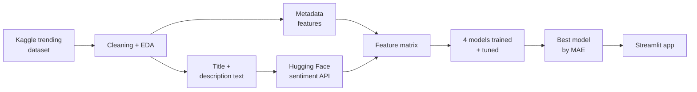

# YouTube Engagement Predictor

Predicts the engagement rate of a YouTube video before it's published, using post metadata and the text of the title and description. 
Built as the capstone for DTSC 691: Applied Data Science.


**[Watch the full walkthrough (video)](https://youtu.be/5keLrlOZ4RY)** — covers the problem, the modeling approach, a code walkthrough, and a live demo of the app.

---

## Problem

Creators decide on a title, a description, and a posting time before they have any feedback on whether those choices will work. The feedback only arrives after publishing, when it's too late to change anything.

This project predicts engagement rate from the information a creator already has in hand before hitting publish. A rule-based approach can handle something like "post in the evening," but it can't weigh how posting time interacts with category, video length, and how strong the title actually reads. It's at that point that makes the model is for.

---

## Data

**Source:** [YouTube Trending Video Statistics](https://www.kaggle.com/datasets/datasnaek/youtube-new) (Kaggle) — records of trending videos across multiple categories, from high-budget music videos to organic viral content.

**Size:** 50531 rows after cleaning, 19 features

The dataset covers trending videos rather than a single creator's channel history. That's a real limitation (see [Limitations](#limitations)), but it means the model learns from content that actually broke through, which is the target creators are aiming at.

**Target variable.** There was no engagement column in the raw data, so the target variable I created was as follows:

```
engagement_rate = (likes + comments) / views
```

Dividing by views normalizes across audience size, so a 50k-view video and a 5M-view video are comparable and subscriber count doesn't need to be a feature. I then percentile-ranked the result so the output means something to a user — "you're in the 72nd percentile" is more useful than a decimal number.

---

## Pipeline



---

## Approach

### Cleaning

Handled programmatically so the pipeline can be rerun on new data:

- Imputed missing values
- Standardized title and description text
- Normalized engagement rates across varying audience sizes
- Cleaned column names, date inputs, and other character junk found especially in the foreign countries' datasets.

### EDA

Descriptive statistics on the engagement metrics, correlation heatmaps between post attributes and engagement, and histograms and box plots on the target to check skewness and outliers. I also checked the distribution of engagement levels for imbalance before committing to a regression framing.

My EDA made me decide to drop the lower and upper 2.5% of the data regarding engagement rate in order to also standardize the distribution. It also allowed me to make my best predictions on which features were the most impactful.

### Feature engineering

Two feature groups get combined into one matrix:

**Metadata:** posting time, content category, and other structural attributes of the post.
FILL: list your actual engineered features — hour of day, day of week, tag count, title length, description length, etc.

**Text:** title and description are passed through a Hugging Face sentiment model, which returns a numerical strength score for each. This replaced my original plan to train a text network from scratch — the pretrained model gave better representations than anything I could train on this dataset size, and it cut training time substantially.

### Models

Four algorithms, 80/20 train/test split, tuned with randomized cross-validation search:

- Linear Regression (baseline)
- Random Forest
- XGBoost
- Neural Network (Keras)

**Metric: Mean Absolute Error.** MAE is the average number of percentage points the prediction misses the true engagement rate by. 

---

## Results

| Model | MAE | Notes |
|---|---|---|
| Linear Regression (baseline) | FILL | |
| Random Forest | FILL | |
| XGBoost | FILL | |
| Neural Network | FILL | |

**Best model: FILL** — MAE of FILL, a FILL% improvement over the linear baseline.

FILL: one sentence on which features mattered most (feature importances from RF/XGBoost).

---

## Key findings

- FILL: something the data actually showed — e.g. how much posting time mattered relative to text sentiment
- FILL: something that surprised you or contradicted the assumption you started with
- FILL: a feature that turned out not to matter

---

## The app

A Streamlit application with four pages: a homepage, a resume page, a projects index, and the project page itself.

On the project page, a user pastes in their intended title, description, and transcript along with pre-post metadata. The app returns three things:

1. **A predicted engagement rate** — "your predicted engagement rate is X%"
2. **Hook feedback** — how strong the title and description read, scored separately
3. **Suggestions** — if the text scores come back low, the app returns specific ways to strengthen them

---

## Repo structure

```

├── app/
│   ├── app.py              # Streamlit entry point
│   └── pages/              # additional app pages
├── notebooks/
│   ├── 01_eda.ipynb        # exploratory analysis
│   ├── 02_features.ipynb   # feature engineering
│   └── 03_modeling.ipynb   # training and evaluation
├── models/                 # serialized model + preprocessing pipeline
├── data/                   # (gitignored — see setup)
├── requirements.txt
└── README.md
```

---

## Running it locally

The app isn't hosted — deployment hit an issue I haven't resolved, so it runs locally for now. The walkthrough video above shows it working end to end if you'd rather not set it up.

```bash
git clone https://github.com/FILL/FILL.git
cd FILL
pip install -r requirements.txt

cd app
streamlit run app.py
```

No API Key Required

The dataset isn't committed. Download it from the Kaggle link above and place it in `data/`.

---

## Limitations

- **The dataset is trending videos, not typical channel performance.** The model learns what separates trending videos from each other, not what makes an average video trend. Predictions are most meaningful as relative guidance.
- **No thumbnail analysis.** Thumbnails drive a large share of click-through and the model doesn't see them at all.
- **No video content analysis.** Nothing frame-by-frame — the model only sees metadata and text.
- **Sentiment is a proxy for "hook strength."** A sentiment score isn't the same thing as how compelling a title is, and treating them as equivalent is the biggest assumption in the pipeline.

---

## Possible extensions

- Thumbnail features through a vision model
- Channel-level history as a feature, if paired with per-channel data
- Deploying the app so it doesn't require local setup

---

## Tech stack

- **Language:** Python
- **Data:** pandas, NumPy
- **Visualization:** Matplotlib, Seaborn
- **Modeling:** scikit-learn, XGBoost, TensorFlow/Keras
- **NLP:** Hugging Face API
- **App:** Streamlit
